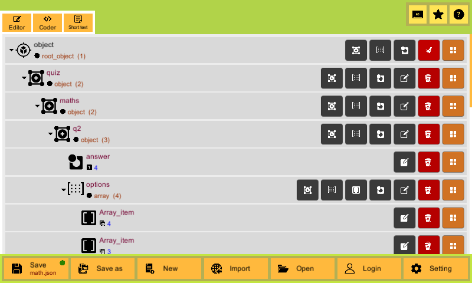

# Json-Editor

### Introducing Json Designer – Your Ultimate Tool for Effortless JSON Creation

Have you ever felt overwhelmed by the complex syntax of JSON while trying to build or edit data for your projects? **Json Designer** is here to change that! This innovative tool is designed to help you create JSON files effortlessly, without needing to be a programming expert.  

#### **Creating JSON Has Never Been Easier**  
With Json Designer, you no longer have to memorize every bracket or comma in JSON syntax. Instead, we offer a **modern and intuitive interface** that allows you to quickly build objects and arrays in JSON structure with just a few clicks. Everything becomes simple and hassle-free.

#### **Versatile Input Forms & Attribute Options**  
Json Designer provides a variety of input forms tailored to different data types, including:  
- **Strings**  
- **Numbers**  
- **Boolean (Logic)**  
- **Colors (with a Color Picker)**  

You can easily add, edit, or remove attributes in seconds while ensuring the accuracy of the data you create.

#### **Seamless JSON Import, Export, and Cloud Storage**  
Need to share or collaborate with your team? Json Designer supports **quick JSON import and export**, saving you valuable time. Additionally, with **cloud storage** linked to your account, your projects are safe and accessible from any device, anytime.

#### **Why Choose Json Designer?**  
- **User-friendly and modern:** A beginner-friendly interface that anyone can navigate.  
- **Time-saving:** No more struggling with syntax errors.  
- **Flexible and powerful:** Easily manage complex objects and array structures in JSON.  
- **Comprehensive support:** Perfect for individuals and teams, whether you're working on small tasks or large-scale applications.

#### **Start Building Perfect JSON Data Today!**  
Let Json Designer be your trusted companion in creating flawless JSON data. Whether you're a developer, a product manager, or just looking to streamline your workflow, Json Designer provides an unmatched experience.  

**Visit Json Designer now and start building your data universe with ease!**
